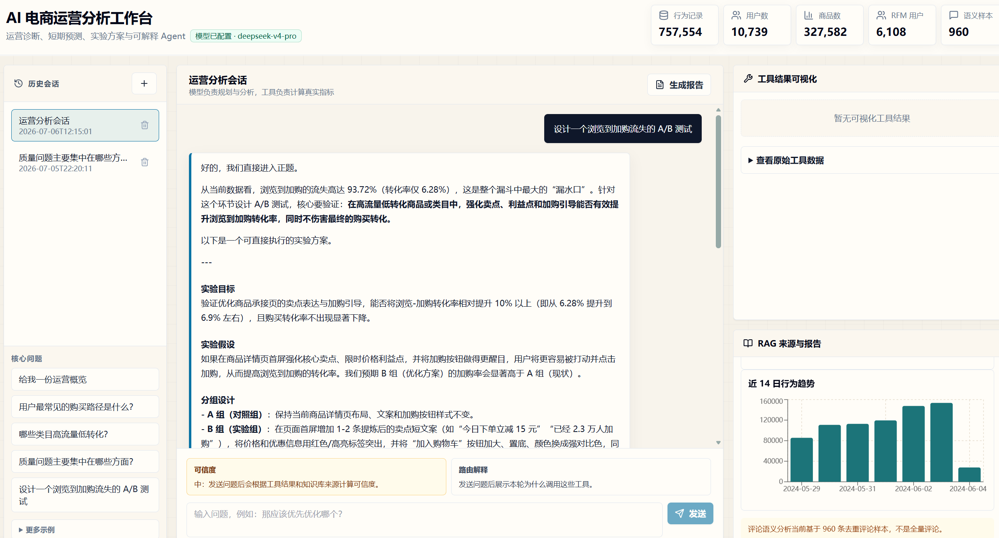
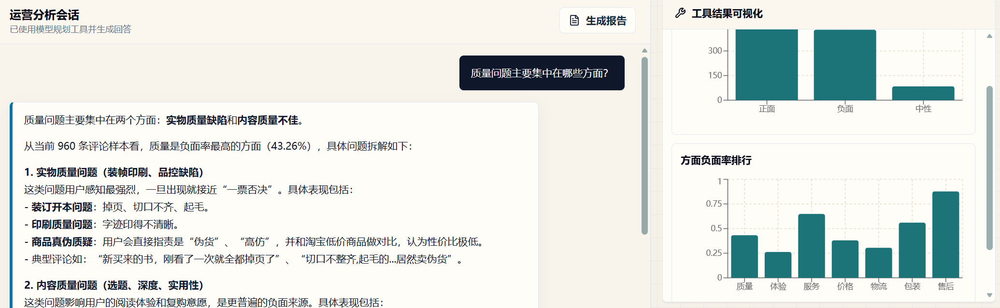
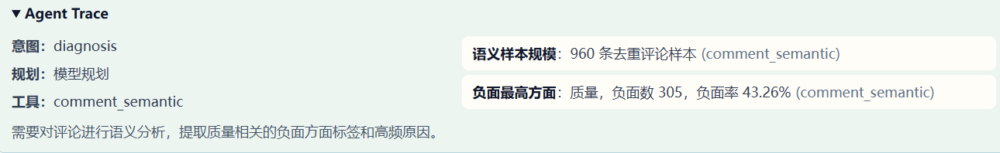
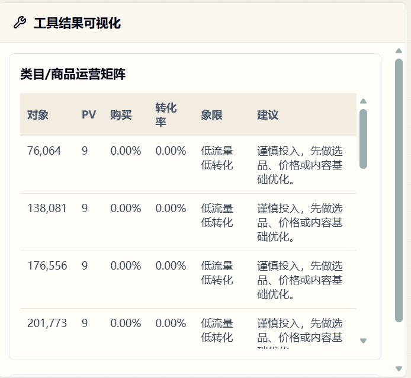
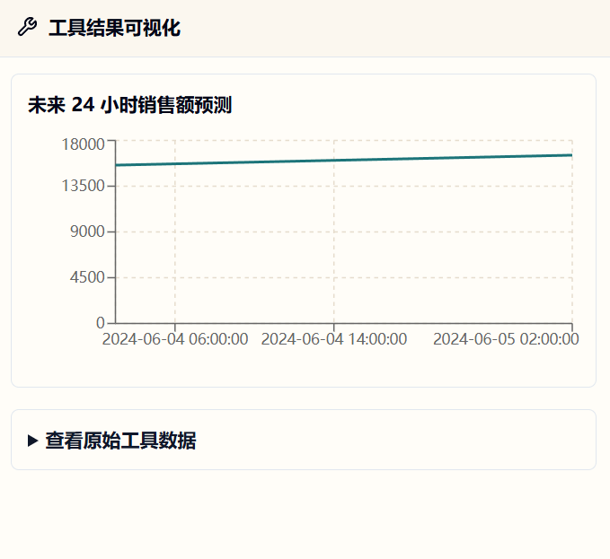

# AI 电商运营分析工作台

这是一个面向电商运营场景的数据分析 Agent 项目。项目基于京东用户行为数据、RFM 用户分层结果和评论语义样本，构建了一个 React + FastAPI 的运营分析工作台，支持自然语言提问、工具化指标计算、评论语义诊断、短期趋势预测、A/B 测试方案生成和 Markdown 报告输出。

项目目标不是做通用聊天机器人，而是让 AI Agent 在真实数据边界内辅助运营人员完成：

- 发现转化流失和运营机会。
- 解释用户路径、类目矩阵、价格带和 RFM 用户差异。
- 基于评论语义样本定位质量、物流、售后、包装等问题。
- 将诊断结果转化为可执行的实验方案。

当前推荐演示入口是 **V6 React + FastAPI 工作台**。V6 的前端已经调整为更接近运营中台的三栏工作台形态：左侧管理会话和核心问题，中间承载分析回答与 Agent Trace，右侧展示工具结果、RAG 来源和报告预览。

## 最新能力

V6「运营诊断与预测增强版」在原有问数 Agent 基础上，新增了更接近运营决策的诊断能力：

| 能力 | 说明 |
| --- | --- |
| 用户路径分析 | 统计浏览、加购、收藏、购买之间的常见路径、路径转化率、关键流失路径和浏览到购买间隔。 |
| 类目/商品运营矩阵 | 按流量和转化将类目或商品划分为高流量高转化、高流量低转化、低流量高转化、低流量低转化。 |
| 评论语义联动 | 基于 960 条去重评论语义样本，分析质量、物流、售后、价格、包装等问题在商品或类目维度的样本分布。 |
| RFM 行为差异 | 比较核心价值用户、重点保持用户、流失用户等群体的类目偏好、加购率、购买率和价格带偏好。 |
| 价格带转化 | 按固定价格区间统计浏览量、购买量、销售额、转化率和用户层分布。 |
| 销售额预测 | 基于小时级历史销售额聚合数据生成未来 24 小时基线预测，只用于短期趋势辅助判断。 |
| A/B 测试方案 | 根据历史诊断结果生成实验目标、实验假设、A/B 分组、核心指标、观察周期、分流方式、成功标准和风险控制。 |

工作台还保留了历史会话、多轮追问、路由解释、回答可信度、工具结果可视化、RAG 来源展示和 Markdown 报告生成能力。当前版本新增了 `Agent Trace` 和工具结果摘要层，用于展示模型如何规划工具、引用哪些关键事实，以及回答可信度来自哪里。

## 界面截图

### 工作台总览



### 评论语义诊断回答



### Agent Trace 与关键证据



### 运营矩阵可视化



### 销售额短期预测



<details>
<summary>历史版本截图</summary>

#### V5 工作台


#### 路由解释与可信度


#### 工具结果可视化


#### Markdown 报告预览


#### Streamlit 自然语言问数


#### 评论语义分析


</details>

## 示例问题

可以在工作台中直接提问：

```text
用户最常见的购买路径是什么？
哪些类目属于高流量低转化？
质量问题主要集中在哪些方面？
核心价值用户和流失用户有什么行为差异？
哪个价格带转化率最高？
未来 24 小时销售额趋势如何？
针对浏览到加购流失高设计一个 A/B 测试方案
```

系统会根据问题选择对应工具，计算结构化指标，并结合 RAG 知识库说明口径和运营策略。

## 数据口径

主分析文件为 `data/processed/jd_analysis_final.csv`。

```text
行为记录数：757,554
用户数：10,739
商品数：327,582
商品类目数：5,357
RFM 用户数：6,108
数据时间范围：2024-05-29 至 2024-06-04
```

行为类型：

```text
pv：浏览，679,668 条
cart：加购，42,714 条
fav：收藏，20,601 条
buy：购买，14,571 条
```

评论语义分析结果来自已有离线样本：

```text
已完成语义分析评论样本：960 条去重评论
正面：447 条
负面：429 条
中性：84 条
```

重要边界：

- 评论语义分析只基于 960 条去重评论样本，适合发现方向，不是全量评论统计。
- 销售额预测只基于短周期历史数据和基线模型，适合未来 24 小时趋势辅助判断，不是长期经营预测。
- A/B 测试模块只生成实验方案，不代表真实线上实验已经完成。
- RAG 只用于解释项目背景、字段含义、指标口径、样本说明和运营策略，不用于遍历行为明细数据。

## 技术架构

```text
React / Vite 前端
  -> FastAPI 后端
  -> SQLite 历史会话
  -> agent_app 复用层
       - data_loader.py       数据加载与标准化
       - metrics.py           固定指标与诊断工具
       - agent.py             工具选择与回答生成
       - rag.py               本地知识库检索
       - semantic_analysis.py 评论语义分析脚本
  -> 本地 CSV / 语义结果 / Markdown 知识库
  -> DeepSeek 或 OpenAI-compatible API
```

核心设计原则：

- 结构化指标由本地工具函数计算，避免让模型编造数据。
- 大模型负责理解问题、规划工具、组织表达和生成运营建议。
- 知识库只解释口径、字段、样本边界和策略，不替代结构化计算。
- Agent Trace 记录本轮意图、工具规划、关键证据和模型状态，方便人工验收。
- 所有涉及样本、预测和实验的回答都必须说明限制。

## 目录结构

```text
agent_app/                  Streamlit 版 Agent 与核心分析能力
backend/                    FastAPI 后端与 SQLite 会话服务
frontend/                   React + Vite 工作台
knowledge_base/             RAG 本地 Markdown 知识库
assets/                     README 截图
data/raw/                   原始数据
data/processed/             清洗后数据、RFM、语义分析结果
notebooks/                  数据分析过程
docs/                       项目说明与设计文档
  agent_design.md           Agent 设计、数据边界和验证说明
  archive/                  历史设计记录归档
reports/visualizations/     Tableau 等可视化产物
```

## 快速运行

### 1. 启动后端

```powershell
cd D:\Agent_data_analyse\data_analyse
python -m pip install -r backend\requirements.txt
python -m uvicorn backend.main:app --reload --port 8000
```

健康检查：

```text
http://127.0.0.1:8000/api/health
```

### 2. 启动前端

另开一个终端：

```powershell
cd D:\Agent_data_analyse\data_analyse\frontend
npm install
npm run dev
```

访问：

```text
http://127.0.0.1:5173
```

### 3. 配置大模型

项目从 `agent_app/.env` 读取 OpenAI-compatible API 配置：

```env
LLM_PROVIDER=deepseek
LLM_API_KEY=你的 API Key
LLM_BASE_URL=https://api.deepseek.com
LLM_MODEL=deepseek-chat
LLM_THINKING_ENABLED=true
LLM_REASONING_EFFORT=high
```

真实 Key 只应保存在本地环境文件中。没有有效 `LLM_API_KEY` 时，系统仍可计算工具结果，但不会生成完整的智能体分析回答。

## API 概览

```text
GET    /api/health
GET    /api/overview
POST   /api/chat
GET    /api/sessions
POST   /api/sessions
GET    /api/sessions/{session_id}
DELETE /api/sessions/{session_id}
POST   /api/sessions/{session_id}/report
GET    /api/semantic/summary
POST   /api/rag/search
```

## 验证

```powershell
cd D:\Agent_data_analyse\data_analyse
python -m pytest backend\tests -q
python -m pytest agent_app\tests -q

cd D:\Agent_data_analyse\data_analyse\frontend
npm run build
```

人工验收建议：

1. 提问 `质量问题主要集中在哪些方面？`，回答应说明 960 条去重评论样本限制。
2. 提问 `哪些类目属于高流量低转化？`，右侧应展示运营矩阵表格。
3. 提问 `未来 24 小时销售额趋势如何？`，右侧应展示预测折线图，并说明短期预测限制。
4. 提问 `针对浏览到加购流失高设计一个 A/B 测试方案`，回答只能生成实验方案，不能声称实验已完成。
5. 展开 `Agent Trace`，应能看到本轮意图、工具规划、关键证据摘要和模型状态。
6. 点击“生成报告”，应能生成当前会话的 Markdown 分析报告。

## 评论语义分析

离线语义分析脚本：

```powershell
python agent_app\semantic_analysis.py --batch-size 20
```

脚本会读取 `jd_analysis_final.csv` 中的评论字段，过滤无效评论，对有效评论去重，然后调用大模型生成情绪、方面标签和负面原因。当前仓库已保留生成后的：

```text
data/processed/comment_semantic_result.csv
data/processed/semantic_summary.csv
```

V6 开发不会重新运行语义分析，也不会覆盖这两个结果文件。

## 版本演进

| 版本 | 重点 |
| --- | --- |
| V1 | Streamlit 问数 Agent，封装基础指标工具。 |
| V2 | 评论语义分析，完成 960 条去重评论样本的情绪、方面和原因标注。 |
| V3 | 本地知识库 RAG，用于回答字段含义、指标口径、样本边界和运营策略。 |
| V4 | React + FastAPI 工作台，增加 SQLite 历史会话和多轮对话。 |
| V5 | 可解释 Agent，加入路由解释、可信度、工具结果可视化和 Markdown 报告。 |
| V6 | 运营诊断与预测增强，加入路径、矩阵、语义联动、价格带、预测、A/B 测试方案、Agent Trace 和新版运营中台界面。 |

## 后续方向

- 回答质量评估集：将典型问题、期望工具、必须包含的口径说明和禁止表达沉淀为可复现测试。
- 报告导出增强：在现有 Markdown 报告基础上支持 PDF 或 Word 输出。
- 前端交互增强：为运营矩阵、路径分析和预测图表增加筛选、排序和导出能力。
