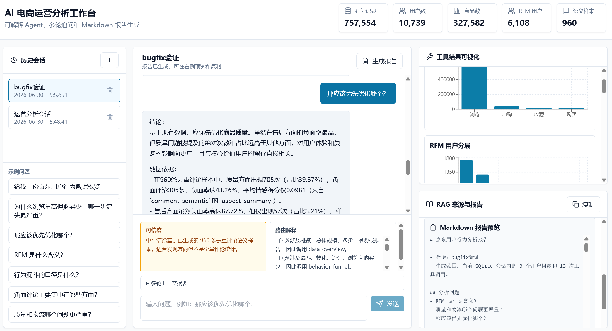
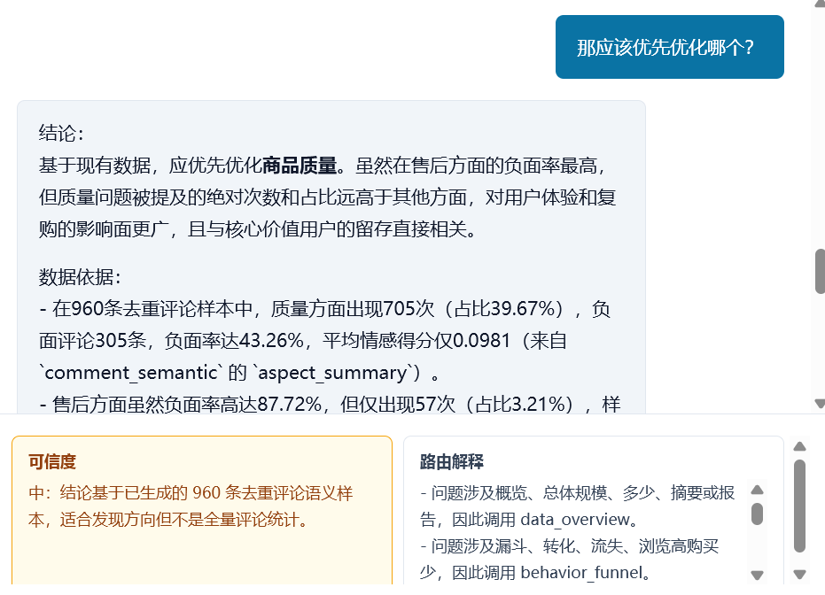
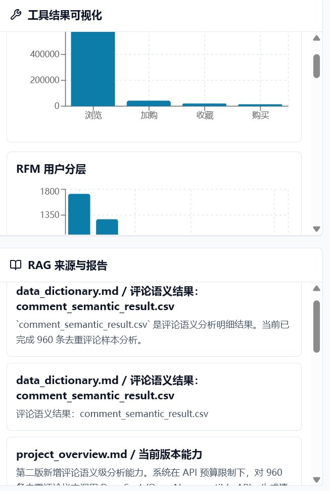
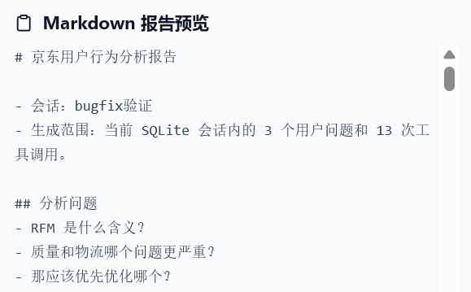
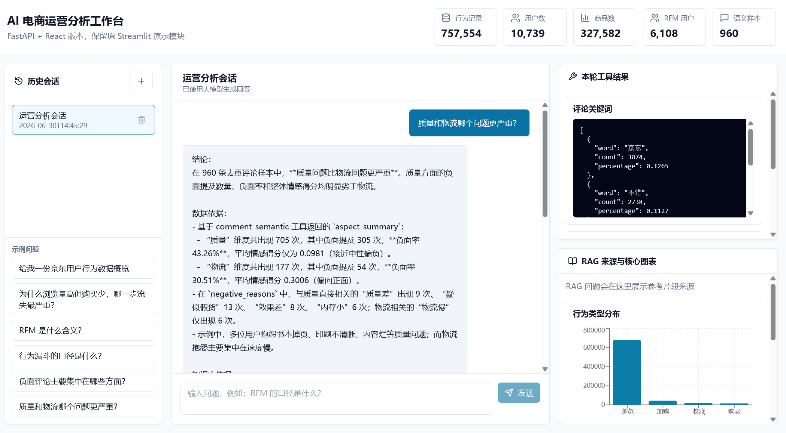
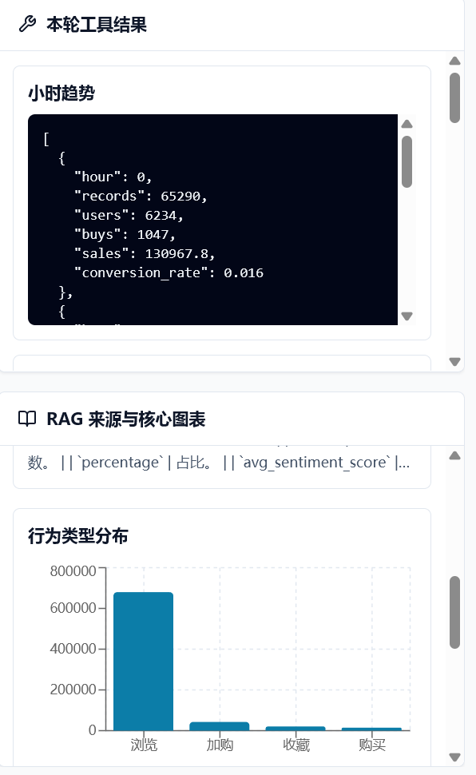
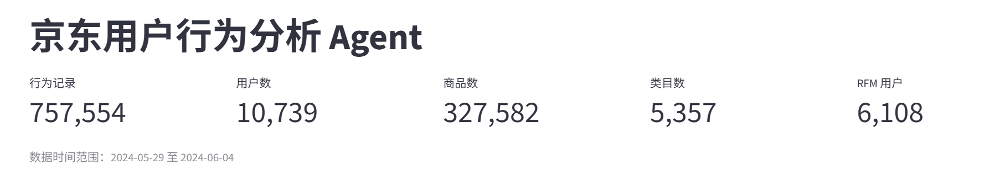
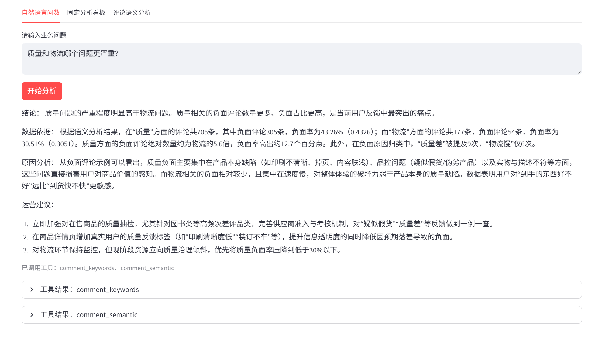
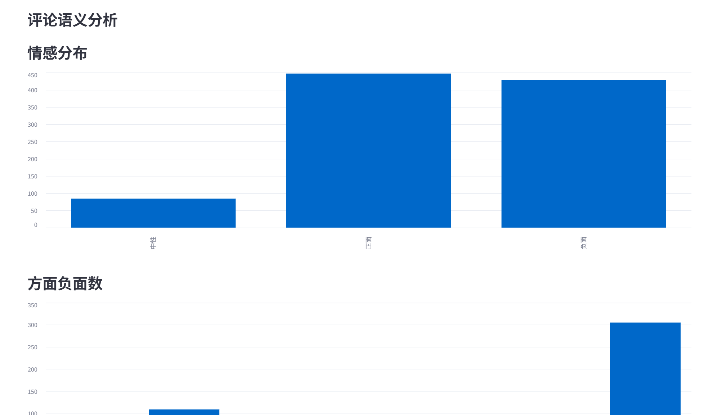
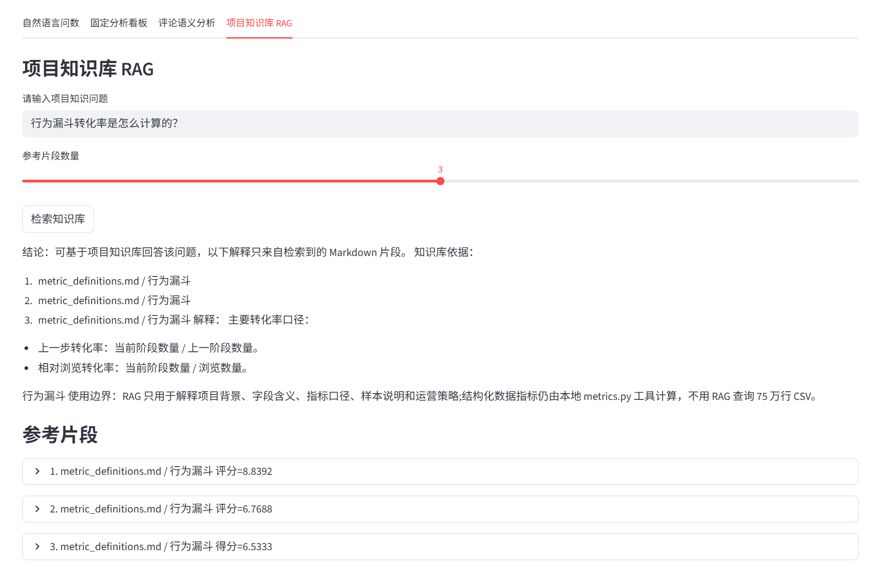

# 京东用户行为分析 Agent

这是一个面向电商运营场景的 AI 数据分析项目。项目基于京东用户行为数据，逐步完成了 Python 数据分析、Streamlit 问数 Agent、评论语义级分析、项目知识库 RAG，以及 React + FastAPI 产品化工作台。

项目目标不是做通用聊天机器人，而是把用户行为分析、评论洞察、指标口径和运营策略封装成一个可交互的数据分析助手。用户可以用自然语言提出业务问题，系统会调用本地数据工具、评论语义结果或知识库 RAG，返回结论、依据、原因分析和运营建议。

## 版本说明

| 版本 | 形态 | 说明 |
| --- | --- | --- |
| V1 | Streamlit 问数 Agent | 封装行为漏斗、RFM、时间趋势、地区、设备、评论关键词等工具。 |
| V2 | 评论语义分析 | 调用 DeepSeek/OpenAI-compatible API，对评论样本做情感分类、方面标签和负面原因归因。 |
| V3 | 项目知识库 RAG | 基于本地 Markdown 知识库回答字段含义、指标口径、语义样本说明和运营策略问题。 |
| V4 | React + FastAPI 工作台 | 新增产品化前端、FastAPI 后端、SQLite 历史会话和多轮对话体验。 |
| V5 | 可解释 Agent 与自动报告 | 新增路由解释、多轮追问增强、回答可信度、工具结果可视化和 Markdown 报告生成。 |

当前推荐演示入口是 V5 工作台；Streamlit 版本仍保留，用作轻量演示和回归验证。

## 项目截图

### V5 AI 电商运营分析工作台



### V5 路由解释与可信度



### V5 工具结果可视化



### V5 Markdown 报告预览



### V4 AI 电商运营分析工作台



### 工具结果、RAG 来源与图表



### Streamlit 数据概览



### Streamlit 自然语言问数



### 评论语义分析



### 项目知识库 RAG



## 核心能力

- 数据概览：展示行为记录数、用户数、商品数、类目数、RFM 用户数和评论语义样本数。
- 行为漏斗：分析浏览、加购、收藏、购买四层行为漏斗及转化率。
- RFM 分层：识别核心价值用户、重点保持用户、流失用户等用户群体，并输出运营建议。
- 时间趋势：按小时和日期分析用户活跃趋势，辅助判断促销时段。
- 地区分析：统计不同地区的销售额和活跃表现。
- 设备转化：比较不同设备的行为量、购买量和转化率。
- 评论关键词：基于词频结果识别用户高频关注点。
- 评论语义分析：对评论样本进行情感分类、方面标签识别和负面原因归因。
- 项目知识库 RAG：回答项目背景、字段含义、指标定义、RFM 口径、行为漏斗口径、语义分析样本说明和运营策略问题。
- 历史会话：React 工作台使用 SQLite 保存多轮会话、消息和工具调用结果。
- 路由解释：展示本轮为什么调用数据概览、行为漏斗、RFM、评论语义或 RAG。
- 多轮追问：基于最近 3 轮会话和上一轮工具结果生成上下文摘要，支持省略主语的追问。
- 回答可信度：按高/中/低展示回答依据，区分确定性统计、样本语义分析和低依据问题。
- Markdown 报告：基于当前会话的问题、回答、工具结果和 RAG 来源一键生成分析报告。
- 可视化增强：用卡片、条形图、折线图和引用卡片替代默认大段 JSON 展示。

## 数据口径

主数据文件为 `data/processed/jd_analysis_final.csv`，当前数据范围：

```text
行为记录数：757,554
用户数：10,739
商品数：327,582
商品类目数：5,357
RFM 用户数：6,108
数据时间范围：2024-05-29 至 2024-06-04
```

行为类型：

```text
pv：浏览，679,668 条
cart：加购，42,714 条
fav：收藏，20,601 条
buy：购买，14,571 条
```

评论语义分析结果为预算内样本分析：

```text
已完成语义分析评论样本：960 条
正面：447 条
负面：429 条
中性：84 条
```

说明：原始有效去重评论约 1.2 万条，当前不是全量语义分析。项目说明、README 和答辩中应表述为“在 API 预算限制下，对 960 条去重评论样本完成语义级情感分析”。

## 技术架构

```text
React/Vite 前端
  -> FastAPI 后端
  -> SQLite 历史会话
  -> agent_app 复用层
       - data_loader.py
       - metrics.py
       - agent.py
       - rag.py
       - semantic_analysis.py
  -> 本地 CSV / 语义结果 / Markdown 知识库
  -> DeepSeek/OpenAI-compatible API
```

系统限制大模型只能解释工具结果和知识库片段，不允许大模型任意执行 Python 代码，也不允许模型编造数据指标。

## 目录结构

```text
agent_app/                  Streamlit 版 Agent 与核心分析能力
  app.py
  agent.py
  data_loader.py
  metrics.py
  semantic_analysis.py
  knowledge_base.py
  rag.py
  prompts.py
  sample_questions.py
  ui_state.py
  tests/

backend/                    FastAPI 后端
  main.py
  database.py
  services.py
  schemas.py
  requirements.txt
  tests/

frontend/                   React + Vite 前端
  src/
  package.json
  vite.config.ts
  tailwind.config.js

knowledge_base/             RAG 本地知识库
  project_overview.md
  data_dictionary.md
  metric_definitions.md
  semantic_analysis_notes.md
  operation_strategy.md

assets/                     README 截图

data/                       数据文件
  raw/                      原始数据
  processed/                清洗后数据、分析结果和语义汇总

notebooks/                  Jupyter 分析过程

docs/                       项目说明、设计文档和 Word 文档

reports/visualizations/     Tableau 等可视化产物
```

## V4 工作台运行方式

### 1. 启动 FastAPI 后端

```powershell
cd D:\Agent_data_analyse\data_analyse
python -m pip install -r backend\requirements.txt
python -m uvicorn backend.main:app --reload --port 8000
```

健康检查：

```text
http://127.0.0.1:8000/api/health
```

### 2. 启动 React 前端

另开一个终端：

```powershell
cd D:\Agent_data_analyse\data_analyse\frontend
npm install
npm run dev
```

默认访问：

```text
http://127.0.0.1:5173
```

前端默认调用：

```text
http://127.0.0.1:8000
```

如需修改后端地址：

```powershell
$env:VITE_API_BASE_URL="http://127.0.0.1:8000"
npm run dev
```

## Streamlit 版运行方式

Streamlit 版本仍然保留：

```powershell
cd D:\Agent_data_analyse\data_analyse
python -m pip install -r agent_app\requirements.txt
streamlit run agent_app\app.py
```

如果 `streamlit` 命令不可用：

```powershell
python -m streamlit run agent_app\app.py
```

## 大模型配置

项目从 `agent_app/.env` 读取 DeepSeek 或其他 OpenAI-compatible API 配置：

```env
LLM_PROVIDER=deepseek
LLM_API_KEY=你的 DeepSeek API Key
LLM_BASE_URL=https://api.deepseek.com
LLM_MODEL=deepseek-v4-pro
LLM_THINKING_ENABLED=true
LLM_REASONING_EFFORT=high
```

安全注意：

- `.env` 放真实密钥，只保存在本地，不要提交到 GitHub。
- `.env.example` 可以提交，用于说明配置格式。
- 如果没有有效 `LLM_API_KEY`，系统仍可运行，但会使用本地模板化降级回答。

## 历史会话

V4 工作台使用 SQLite 保存历史会话：

```text
backend/jd_agent_workbench.sqlite3
```

包含：

```text
sessions    会话列表
messages    用户和 Agent 消息
tool_calls  每轮调用的工具、RAG 来源和结果摘要
```

刷新 React 页面后，系统会从 `/api/sessions` 和 `/api/sessions/{session_id}` 读取历史记录。该数据库包含本地对话记录，默认不建议提交到 GitHub。

## API 概览

```text
GET    /api/health
GET    /api/overview
POST   /api/chat
GET    /api/sessions
POST   /api/sessions
GET    /api/sessions/{session_id}
DELETE /api/sessions/{session_id}
POST   /api/sessions/{session_id}/report
GET    /api/semantic/summary
POST   /api/rag/search
```

## 评论语义分析

离线语义分析脚本：

```powershell
python agent_app\semantic_analysis.py --batch-size 20
```

脚本流程：

1. 从 `data/processed/jd_analysis_final.csv` 读取 `comment` 字段。
2. 过滤空评论、“无评论”、“暂无评论”、“默认好评”等无效文本。
3. 对有效评论去重，并使用 `comment_hash` 作为缓存键。
4. 分批调用 DeepSeek/OpenAI-compatible API。
5. 将明细写入 `data/processed/comment_semantic_result.csv`。
6. 将聚合统计写入 `data/processed/semantic_summary.csv`。
7. 再次运行时自动跳过已处理评论，支持断点续跑。

字段口径：

- `sentiment`：正面 / 中性 / 负面。
- `sentiment_score`：范围为 -1 到 1，越接近 1 越正面，越接近 -1 越负面。
- `aspects`：固定方面标签，包括质量、物流、价格、服务、包装、售后、体验。
- `negative_reasons`：负面或中性偏负评论的原因短语。

## 项目知识库 RAG

RAG 只读取 `knowledge_base/*.md`，用于回答项目知识和业务口径问题，不读取或遍历 75 万行行为 CSV。

适合 RAG 回答的问题：

```text
pv、cart、fav、buy 分别是什么意思？
RFM 的 R、F、M 分别代表什么？
行为漏斗转化率是怎么计算的？
sentiment_score 是什么含义？
为什么评论语义分析只分析了 960 条？
质量问题和售后问题分别应该怎么运营？
这个 Agent 的使用边界是什么？
```

结构化指标问题仍由 `metrics.py` 中的本地工具函数计算，例如浏览量、购买转化率、地区销售额、设备转化率、RFM 占比等。

## 验证

后端测试：

```powershell
cd D:\Agent_data_analyse\data_analyse
python -m pytest backend\tests -q
```

Agent 测试：

```powershell
python -m pytest agent_app\tests -q
```

前端构建：

```powershell
cd D:\Agent_data_analyse\data_analyse\frontend
npm run build
```

人工验收建议：

1. 访问 `http://127.0.0.1:8000/api/health`，应返回后端健康状态。
2. 访问 `http://127.0.0.1:5173`，顶部指标卡应显示真实数据规模。
3. 新建会话后发送问题，页面应展示 Agent 回答。
4. 刷新页面后，左侧应能恢复 SQLite 中的历史会话。
5. 提问 `RFM 是什么含义？`，右侧应展示 RAG 来源片段。
6. 提问 `质量和物流哪个问题更严重？`，回答应基于 960 条语义样本，不应声称全量分析。
7. Streamlit 旧版仍应能正常启动。

## Git 提交注意

不要提交真实密钥、依赖目录、构建产物和本地历史库：

```text
agent_app/.env
frontend/node_modules/
frontend/dist/
backend/jd_agent_workbench.sqlite3
__pycache__/
.pytest_cache/
```

推荐提交源码、知识库、截图和样本结果：

```text
agent_app/
backend/
frontend/src/
frontend/package.json
frontend/package-lock.json
knowledge_base/
assets/
docs/README_agent.md
data/processed/comment_semantic_result.csv
data/processed/semantic_summary.csv
```

## 项目亮点

本项目将传统数据分析结果封装为可交互的 AI 数据分析工作台，覆盖结构化行为数据、RFM 用户分层、评论词频、评论语义分析、项目知识库 RAG 和多轮历史会话。系统通过固定工具函数保证指标来自真实数据，通过 RAG 片段引用降低大模型编造风险，并通过 SQLite 保存历史会话，使项目从数据分析 Demo 升级为更接近真实产品的 AI 运营分析原型。

## 后续扩展

- 增加 MCP：将行为漏斗、RFM 分层、评论语义分析和 RAG 检索封装为外部 Agent 可调用的工具。
- 增强图表：用更完整的 Recharts 图表展示漏斗、RFM、地区销售、设备转化和语义负面原因。
- 增加 PDF 导出：在现有 Markdown 报告基础上继续支持 PDF 报告导出。
## 第五版：可解释 Agent 与自动分析报告

第五版在现有 React + FastAPI 工作台基础上增量增强，运行方式不变，仍然保留 Streamlit 版本，不覆盖 `agent_app/.env`，不重新清洗 CSV，不重新运行评论语义分析，也不改动 `data/processed/comment_semantic_result.csv` 和 `data/processed/semantic_summary.csv`。

新增能力：

- Agent 路由解释：`/api/chat` 追加返回 `routing_explanation`，说明本轮为什么调用数据概览、行为漏斗、RFM、评论语义或 RAG。
- 多轮追问增强：后端读取 SQLite 最近 3 轮消息和上一轮工具调用结果，生成 `context_summary`，支持“那应该优先优化哪个？”“具体怎么做？”等省略主语追问。没有上下文时返回低可信度并要求补充对象。
- 回答可信度：`/api/chat` 追加返回 `confidence`，等级为高/中/低，并说明依据。结构化工具统计通常为高；RAG 或 960 条语义样本为中；缺少对象、缺少数据或知识库无依据为低。
- 工具结果可视化：`/api/chat` 追加返回 `visual_payloads`，前端优先展示指标卡、条形图、折线图和 RAG 引用卡片；原始 JSON 保留在“查看原始工具数据”折叠区。
- 一键 Markdown 报告：新增 `POST /api/sessions/{session_id}/report`，基于当前会话的问题、回答、工具调用和 RAG 来源生成 Markdown 报告。

报告结构固定为：

```text
标题
分析问题
关键结论
数据依据
RAG/知识库依据
运营建议
风险与限制
```

涉及评论语义分析时，回答和报告必须写明：当前是 960 条去重评论样本，不是全量评论。

运行方式仍然是：

```powershell
cd D:\Agent_data_analyse\data_analyse
python -m uvicorn backend.main:app --reload --port 8000
```

另开终端：

```powershell
cd D:\Agent_data_analyse\data_analyse\frontend
npm run dev
```

第五版新增接口：

```text
POST /api/sessions/{session_id}/report
```

功能截图：

```text
assets/workbench_full.png
assets/explainable_agent.png
assets/enhanced_visuals.png
assets/markdown_report.png
```

验证命令：

```powershell
python -m pytest backend\tests -q
python -m pytest agent_app\tests -q
cd frontend
npm run build
```

人工验证建议：

1. 在 React 工作台提问 `RFM 是什么含义？`，右侧应展示路由解释、可信度和 RAG 来源。
2. 先问 `质量和物流哪个问题更严重？`，再追问 `那应该优先优化哪个？`，应显示上下文摘要并基于上一轮继续回答。
3. 新会话直接问 `那应该优先优化哪个？`，应返回低可信度并要求补充对象，不应编造结论。
4. 点击“生成报告”，应展示 Markdown 报告预览，并可复制。
5. 点击“查看原始工具数据”，仍可查看本轮工具原始结果。
