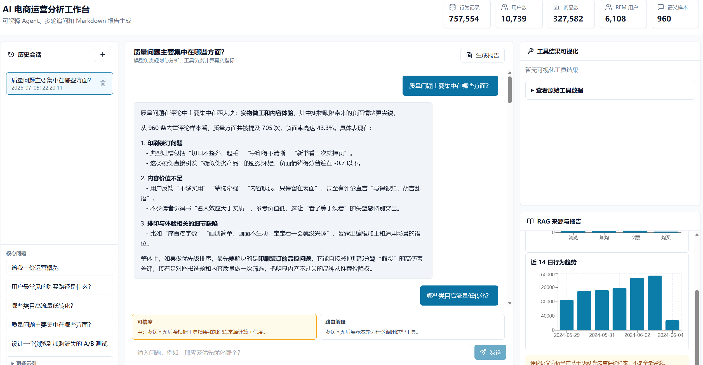
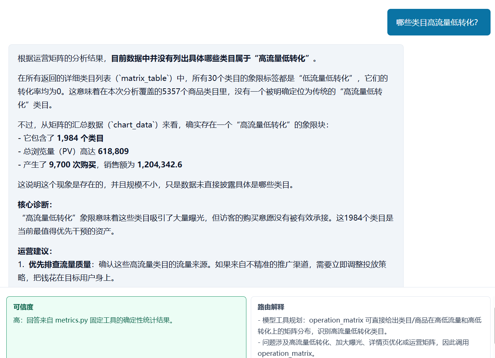
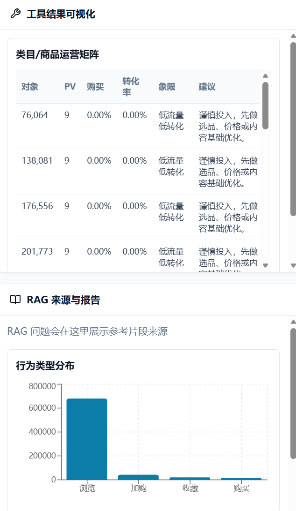

# Agent 设计说明

本文档是根目录 `README.md` 的补充说明。项目展示、运行方式和最新截图以根目录 README 为准；本文保留 Agent 设计口径、数据边界和验证方式，便于答辩或二次整理文档时引用。

## 项目定位

本项目面向电商运营分析场景，将用户行为数据、RFM 用户分层、评论语义样本和本地知识库封装为一个可交互的 AI Agent 工作台。

Agent 的职责不是替代真实实验或实时经营系统，而是在当前历史数据范围内帮助运营人员：

- 识别浏览、加购、收藏、购买路径中的关键流失。
- 发现高流量低转化类目或商品。
- 分析评论语义样本中的质量、物流、售后、包装等问题。
- 比较不同 RFM 用户层的行为差异。
- 输出短期销售额趋势辅助判断。
- 生成可执行的 A/B 测试方案。

## V6 核心能力

| 能力 | 说明 |
| --- | --- |
| 用户路径分析 | 统计用户从浏览到购买之间的常见路径、转化率和流失路径。 |
| 运营矩阵 | 按流量和转化划分类目或商品，辅助识别优化和放量对象。 |
| 评论语义联动 | 基于 960 条去重评论样本，分析问题方面在商品或类目上的分布。 |
| RFM 行为差异 | 对比不同用户层的类目偏好、加购率、购买率和价格带偏好。 |
| 价格带转化 | 按固定价格区间统计浏览、购买、销售额和转化率。 |
| 销售额预测 | 基于小时级销售额聚合数据，输出未来 24 小时基线预测。 |
| A/B 测试方案 | 基于历史诊断生成实验目标、假设、分组、指标和风险控制。 |

## 展示截图

### V6 工作台



### 运营矩阵回答



### 分析依据面板



## 数据口径

主数据来自：

```text
data/processed/jd_analysis_final.csv
data/processed/jd_rfm_result.csv
data/processed/comment_semantic_result.csv
data/processed/semantic_summary.csv
```

当前结构化行为数据范围：

```text
行为记录数：757,554
用户数：10,739
商品数：327,582
商品类目数：5,357
RFM 用户数：6,108
时间范围：2024-05-29 至 2024-06-04
```

评论语义分析结果：

```text
960 条去重评论样本
正面：447 条
负面：429 条
中性：84 条
```

使用限制：

- 评论语义结果不是全量评论统计，只适合发现方向。
- 销售额预测只适合短期趋势辅助判断。
- A/B 测试模块只生成实验方案，不代表实验已完成。
- RAG 只解释字段、口径、样本边界和运营策略，不遍历 75 万行行为明细。

## 技术架构

```text
React / Vite 前端
  -> FastAPI 后端
  -> SQLite 历史会话
  -> agent_app 复用层
       - metrics.py
       - agent.py
       - rag.py
       - semantic_analysis.py
  -> 本地 CSV / 语义结果 / Markdown 知识库
  -> DeepSeek 或 OpenAI-compatible API
```

结构化指标由工具函数计算，大模型负责理解问题、组织表达和生成运营建议。这样可以降低模型编造指标的风险。

## 运行方式

启动后端：

```powershell
cd D:\Agent_data_analyse\data_analyse
python -m uvicorn backend.main:app --reload --port 8000
```

启动前端：

```powershell
cd D:\Agent_data_analyse\data_analyse\frontend
npm run dev
```

访问：

```text
http://127.0.0.1:5173
```

## 验证方式

```powershell
cd D:\Agent_data_analyse\data_analyse
python -m pytest backend\tests -q
python -m pytest agent_app\tests -q

cd D:\Agent_data_analyse\data_analyse\frontend
npm run build
```

推荐人工验证问题：

```text
质量问题主要集中在哪些方面？
哪些类目属于高流量低转化？
未来 24 小时销售额趋势如何？
针对浏览到加购流失高设计一个 A/B 测试方案
```

回答中应能看到真实数据依据、样本限制和运营建议；涉及评论语义时必须说明 960 条去重评论样本口径。
